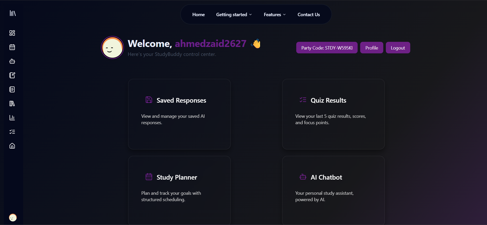
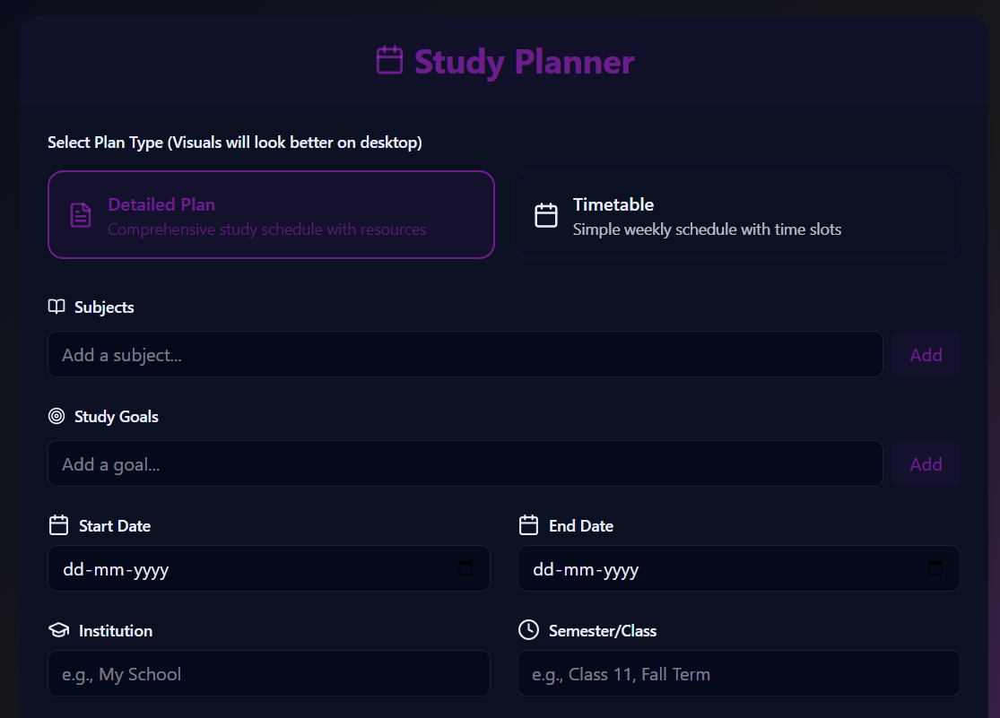
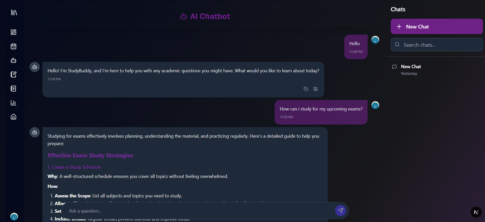
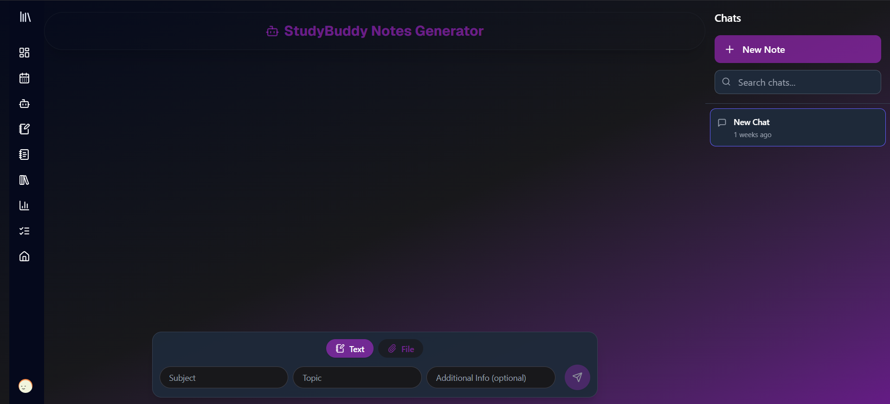
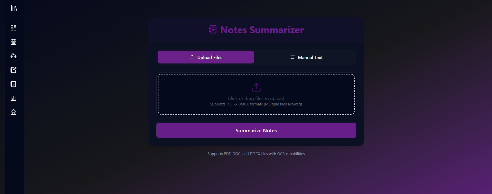
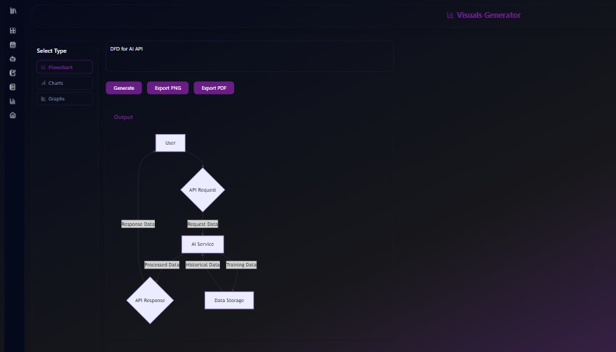

# 📚 StudyBuddy – Your AI-Powered Study Partner

StudyBuddy is a modern, AI-powered web platform designed to help students collaborate, learn, and stay organized. With features like AI chat, note generation, study planning, and real-time study clubs, StudyBuddy is your all-in-one academic companion.

---

## 🚀 Features

- **AI Chatbot**: Get instant academic help, ask questions, clarify concepts, and generate summaries. The chatbot evolves with your needs to offer tailored support.
- **Notes Generator**: Turn raw lecture material or textbook paragraphs into well-organized, concise notes. Supports markdown, headings, lists, and mind maps.
- **Notes Summarizer**: Compress lengthy notes or documents into essential bullet points. Supports PDFs, DOCX, and plain text files.
- **Visuals Generator**: Transform prompts into diagrams, charts, and flowcharts (image, SVG, Mermaid.js). Ideal for visual learners and presentations.
- **Study Planner**: Effortlessly structure your semester with AI-generated weekly study plans. Manage goals, track progress, and optimize study sessions.
- **Last Minute Revision Kit**: Get formulas, definitions, flashcards, Q&A, and more for last-minute revision.
- **Quiz Generator**: Create custom quizzes from your notes or files. Choose question type, difficulty, and get instant feedback.
- **Study Clubs**: Collaborate in real-time with peers via chat, video, file sharing, and whiteboards. Create or join clubs with a single link.
- **Saved Responses & Dashboard**: Save, organize, and review your AI-generated content and quiz results in a personalized dashboard.
- **Secure Authentication**: Modern login/signup with NextAuth.js, Google OAuth, and robust session management.

---

## 🖼️ Screenshots

- 
- 
- 
- 
- 
- 

---

## 🛠️ Tech Stack

- **Framework**: [Next.js 14+ (App Router)](https://nextjs.org/)
- **Backend**: Node.js, [Mongoose (MongoDB)](https://mongoosejs.com/)
- **Authentication**: [NextAuth.js](https://next-auth.js.org/)
- **AI API**: Google Gemini via [Vercel AI SDK](https://vercel.com/docs/ai)
- **Real-Time UI**: React Server Components, Suspense, App Router Streaming
- **Design**: Tailwind CSS, shadcn/ui, Lucide Icons
- **Other**: Framer Motion, UploadThing, PDF/Docx parsing, Chart.js, Mermaid.js

---

## ⚡ Quick Start

- Visit [https://studybuddy.rest](https://studybuddy.rest) to get started.

---

## 🧭 Usage Guide

- **Dashboard**: After login, access all features from your personalized dashboard.
- **AI Chatbot**: Ask questions, get explanations, and save responses.
- **Notes Generator**: Input text or upload files to generate structured notes.
- **Study Planner**: Enter your subjects, goals, and dates to get a detailed weekly plan.
- **Visuals Generator**: Describe a chart or diagram and get instant visuals.
- **Study Clubs**: Create or join a club, invite friends, and collaborate in real time.
- **Quiz Generator**: Generate quizzes from your notes and track your results.
- **Saved Responses**: Review and manage your saved content and quiz history.

---

## 📚 Example Flows

- **Generate a Study Plan**: Go to Study Planner → Enter your subjects, goals, and dates → Get a detailed, week-by-week plan.
- **Summarize Notes**: Go to Notes Summarizer → Paste or upload your notes → Get concise bullet points and key takeaways.
- **Collaborate in a Study Club**: Create a club, share the code, and work together with chat, video, and shared files.

---

## 🙋 FAQ

- **Is my data private and secure?**
  - Yes. We use modern encryption and cloud infrastructure to keep your data safe. We do not sell or share your personal information with third parties.
- **Can I use StudyBuddy for free?**
  - Yes! StudyBuddy is free for students and educators.
- **How do I get support?**
  - Open an issue on GitHub or contact the maintainer at [ahmedzaid2627@gmail.com](mailto:ahmedzaid2627@gmail.com).

---

## 👤 Author

Developed by [Zaid Ahmed Ansari](https://www.linkedin.com/in/zaid-ahmed-ansari-aa9272293/)

---

> _Empowering students to learn, collaborate, and succeed with AI._
